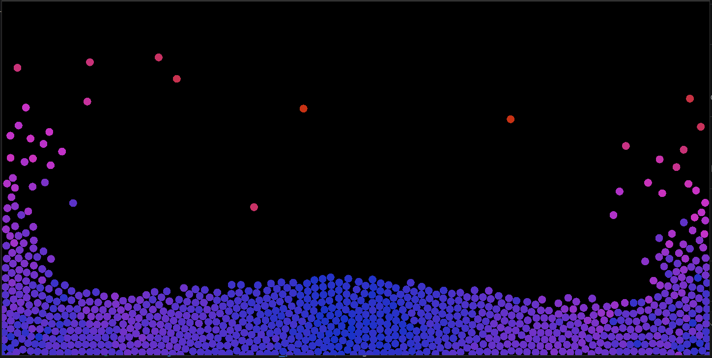
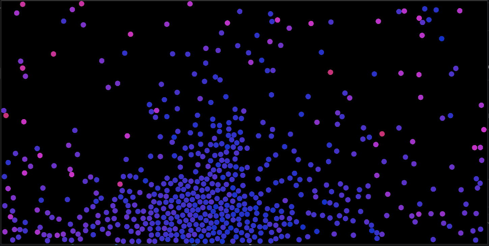

# Rust Particle Physics Engine

---

## ✨ Features

* 🚀 High-performance particle simulation written in pure Rust
* ⚡ Efficient sequential collision detection and response
* 🌍 Configurable gravitational interactions
* 🔄 Euler integration methods
* 🧩 Modular architecture for custom force implementations
* 🎨 Real-time visualization support

---

## 📸 Screenshots

### Particle Collision Simulation


---





---


## Installation


To build from source:

```bash
git clone https://github.com/bislimkoci/Particle-Physics-Engine.git
cd Particle-Physics-Engine
cargo build --release
```

---


## Physics Model

The engine currently supports:

* Particle-particle collisions using spatial hash
* Gravity-based interactions
* Boundary constraints
* Custom force generators

---

## Performance

Benchmarks performed on:

* CPU: 11th Gen Intel(R) Core(TM) i7-1195G7 @ 2.90GHz
* Rust: Stable
* Build: `--release`

Max particle before very low frame rate: **4000** particles


---


## Roadmap

* [ ] Concurrency implementation
* [ ] GPU acceleration
* [ ] 3D particle support
* [ ] Barnes-Hut optimization
* [ ] Constraint solver improvements
* [ ] WASM support for browser simulations
* [ ] Interactive visualization tools

---


## License

This project is licensed under the **Apache 2.0 License**.

See the LICENSE file for details.

---


## Star History

If you find this project useful, consider giving it a ⭐ on GitHub!

It helps others discover the project and motivates future development.
